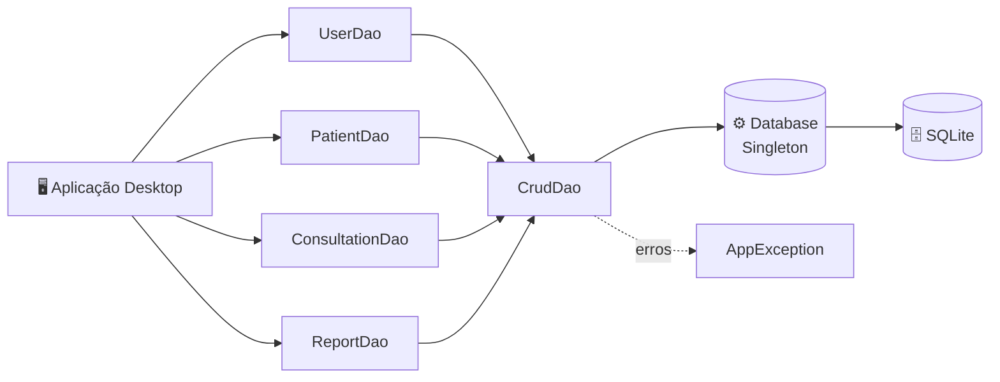

<div align="center">

# 🥗 Nutrimind Desktop

### Gestão nutricional inteligente, na palma da sua mesa

*Cuidar da alimentação começa por organizar o cuidado. O Nutrimind reúne pacientes, consultas e relatórios em um só lugar.*

<br>


</div>

---

## 📑 Sumário

- [Sobre o projeto](#-sobre-o-projeto)
- [Funcionalidades](#-funcionalidades)
- [Arquitetura](#-arquitetura)
- [Estrutura do código](#-estrutura-do-código)
- [Como executar](#-como-executar)
- [Decisões de projeto](#-decisões-de-projeto)
- [Equipe](#-equipe)
- [Roadmap](#-roadmap)

---

## 💡 Sobre o projeto

O **Nutrimind** é uma aplicação **desktop em Java** voltada à gestão de atendimentos nutricionais. Ele foi pensado para facilitar o dia a dia de quem cuida da saúde alimentar de outras pessoas: cadastrar pacientes, registrar consultas e acompanhar a evolução por meio de relatórios.

Este projeto nasceu como o **trabalho principal do nosso grupo** no curso de **Engenharia de Software** do **UNIFSA (Centro Universitário Santo Agostinho)**, acompanhando a gente ao longo do período e sendo apresentado no evento acadêmico **II InterConnect Evolution**.

> 🎯 **Objetivo:** aplicar, em um projeto completo e realista, tudo o que aprendemos sobre programação orientada a objetos, banco de dados, padrões de projeto e trabalho em equipe.

> 📦 Este repositório contém a **camada de persistência** do projeto. A versão integrada do grupo (MVP) está em [`karlitus222/nutrimind-mvp-desktop`](https://github.com/karlitus222/nutrimind-mvp-desktop).

---

## ✨ Funcionalidades

| | Módulo | O que faz |
|---|---|---|
| 👤 | **Usuários** | Cadastro e gerenciamento dos usuários do sistema |
| 🧑‍⚕️ | **Pacientes** | Registro e acompanhamento dos pacientes atendidos |
| 📅 | **Consultas** | Agendamento e histórico de consultas |
| 📊 | **Relatórios** | Consulta de informações para acompanhar a evolução |
| 🛡️ | **Tratamento de erros** | Exceção própria da aplicação, com mensagens claras |

---

## 🏗️ Arquitetura

O acesso aos dados segue o padrão **DAO (Data Access Object)**: cada entidade tem uma classe responsável por conversar com o banco, e todas compartilham uma base comum de operações CRUD.



### 🧠 Em palavras simples

- **DAO**: em vez de espalhar comandos SQL pelo sistema, cada tabela tem uma classe "porteira" que cuida de ler e gravar os dados.
- **CrudDao**: guarda o que todo mundo precisa em comum (criar, ler, atualizar e apagar), evitando código repetido.
- **Database (Singleton)**: garante que existe **uma única** configuração/conexão com o banco, compartilhada por toda a aplicação.
- **AppException**: um tipo de erro próprio, para tratar falhas do sistema de forma organizada.

---

## 🗂️ Estrutura do código

```
nutrimind-desktop/
└── src/main/java/br/com/nutrimind/
    ├── config/
    │   └── Database.java          # Configuração e acesso ao SQLite (Singleton)
    ├── dao/
    │   ├── CrudDao.java           # Base com as operações CRUD genéricas
    │   ├── UserDao.java           # Persistência de usuários
    │   ├── PatientDao.java        # Persistência de pacientes
    │   ├── ConsultationDao.java   # Persistência de consultas
    │   └── ReportDao.java         # Persistência de relatórios
    └── exception/
        └── AppException.java      # Exceção personalizada da aplicação
```

---

## 🚀 Como executar

### Pré-requisitos

- ☕ [JDK 17+](https://adoptium.net/)
- 📦 [Maven](https://maven.apache.org/download.cgi)

### Passo a passo

```bash
# 1. Clone o repositório
git clone https://github.com/guilhermeestrela10/nutrimind-desktop.git

# 2. Entre na pasta
cd nutrimind-desktop

# 3. Baixe as dependências e compile
mvn clean install
```

> 💡 O banco **SQLite** é um arquivo local, então não é preciso instalar nenhum servidor de banco de dados.

Para rodar a aplicação completa com a interface, use o repositório do grupo: [`nutrimind-mvp-desktop`](https://github.com/karlitus222/nutrimind-mvp-desktop).

---

## 🧭 Decisões de projeto

<details>
<summary><b>Por que SQLite?</b></summary>

É leve, não exige servidor e guarda tudo em um único arquivo. Para um app desktop, isso deixa a instalação e a apresentação muito mais simples.
</details>

<details>
<summary><b>Por que o padrão DAO?</b></summary>

Separa a lógica do sistema do acesso ao banco. Se amanhã o banco mudar, só a camada DAO precisa ser ajustada.
</details>

<details>
<summary><b>Por que Singleton na conexão?</b></summary>

Evita múltiplas conexões abertas ao mesmo tempo e mantém a configuração do banco em um único lugar.
</details>

<details>
<summary><b>Por que Maven?</b></summary>

Padroniza a estrutura do projeto e automatiza o download de dependências e o build, o que ajuda muito no trabalho em grupo.
</details>

---

## 👥 Equipe

Projeto desenvolvido em grupo por estudantes de Engenharia de Software do UNIFSA.

| Integrante | Contribuição |
|---|---|
| **Guilherme Estrela** ([@guilhermeestrela10](https://github.com/guilhermeestrela10)) | Camada de persistência (DAO) e integração com o banco de dados |
| _Nome do integrante_ | _Responsabilidade_ |
| _Nome do integrante_ | _Responsabilidade_ |
| _Nome do integrante_ | _Responsabilidade_ |

---

## 🗺️ Roadmap

- [x] Camada de persistência com padrão DAO
- [x] Operações CRUD para usuários, pacientes, consultas e relatórios
- [x] Tratamento de erros com exceção própria
- [ ] Testes automatizados da camada DAO
- [ ] Geração de relatórios em PDF
- [ ] Plano alimentar personalizado por paciente

---

<div align="center">

### 🌱 Feito com dedicação, café e muito trabalho em equipe

**UNIFSA** · Engenharia de Software · II InterConnect Evolution

</div>
